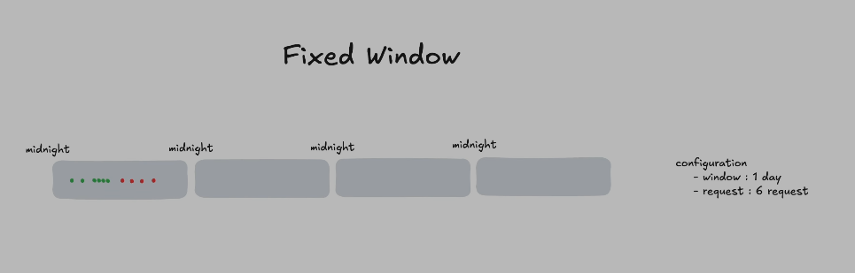
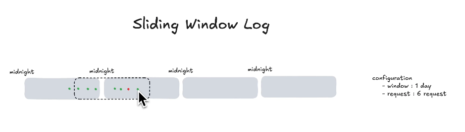
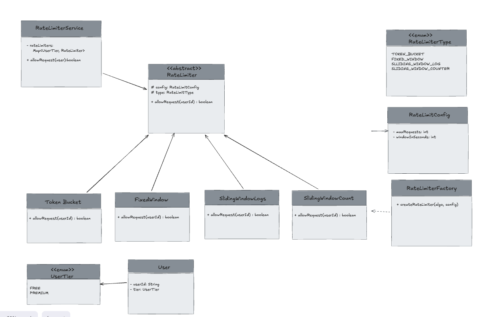

## Rate limiter

Configuration
    - time_window (00:00 to 23:59)(entire day)
    - no. of requests in window (6 times)

Requirements:

- Rate limit the user based on userID and their tier(free or premium)
  - eg: free: 2 req in 10 seconds; premium: 8 requests in 10 seconds
- Support 4 types of rate limiters. (token bucket, fixed window, sliding window log, sliding window counter)
  - This design should be extensible.
- Thread safe and efficient
  - we don't want any inaccuracies.
  - api takes 4 ms but rate limiter takes 2 seconds. it means rate limiter is not efficient. we have to have an efficient rate limiter.

### Fixed window
- config:
  - window: 1 day
  - request: 6 requests
- pros
  - simple to implement and understand
  - predictable for users
- cons
  - if requesting at the end of the day and start of the next day, possibly we will have 2x burst time traffic.

### Sliding window log
- config:
  - window: 1 day
  - request: 6 requests
- it would only accept 6 requests in a window. the moment 7th request 
- pros:
  - better than fixed window. 
  - don't have too much extra traffic.
- cons:
  - need to store all successful requests in a queue.so that it can pop out the first ever request when 

### Token Bucket
- bucket can have a limit on number of tokens.
- config:
    - window: 1 day
    - request: 6 requests (maximum number of tokens in the bucket)
- refill_rate = window/request = 24/6 = 4 (after every 4 hours, 1 token will be added to the bucket) 
- if tokens are available, number of available tokens will be decremented by 1 and the request is forwarded to the server.

## UML class diagram:

